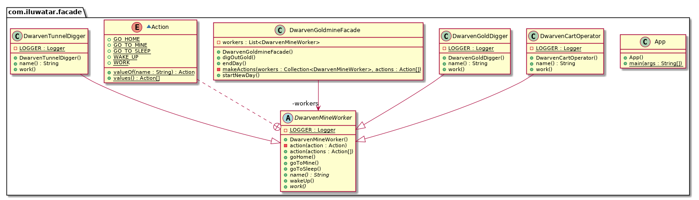

@Slf4j
public abstract class DwarvenMineWorker {

    public void goToSleep() {
        LOGGER.info("{} goes to sleep.", name());
    }

    public void wakeUp() {
        LOGGER.info("{} wakes up.", name());
    }

    public void goHome() {
        LOGGER.info("{} goes home.", name());
    }

    public void goToMine() {
        LOGGER.info("{} goes to the mine.", name());
    }

    private void action(Action action) {
        switch (action) {
            case GO_TO_SLEEP -> goToSleep();
            case WAKE_UP -> wakeUp();
            case GO_HOME -> goHome();
            case GO_TO_MINE -> goToMine();
            case WORK -> work();
            default -> LOGGER.info("Undefined action");
        }
    }

    public void action(Action... actions) {
        Arrays.stream(actions).forEach(this::action);
    }

    public abstract void work();

    public abstract String name();

    enum Action {
        GO_TO_SLEEP, WAKE_UP, GO_HOME, GO_TO_MINE, WORK
    }
}
```

Then we have the concrete dwarf classes `DwarvenTunnelDigger`, `DwarvenGoldDigger` and 
`DwarvenCartOperator`:

```java
@Slf4j
public class DwarvenTunnelDigger extends DwarvenMineWorker {

  @Override
  public void work() {
    LOGGER.info("{} creates another promising tunnel.", name());
  }

  @Override
  public String name() {
    return "Dwarven tunnel digger";
  }
}

@Slf4j
public class DwarvenGoldDigger extends DwarvenMineWorker {

  @Override
  public void work() {
    LOGGER.info("{} digs for gold.", name());
  }

  @Override
  public String name() {
    return "Dwarf gold digger";
  }
}

@Slf4j
public class DwarvenCartOperator extends DwarvenMineWorker {

  @Override
  public void work() {
    LOGGER.info("{} moves gold chunks out of the mine.", name());
  }

  @Override
  public String name() {
    return "Dwarf cart operator";
  }
}

```

To operate all these goldmine workers we have the `DwarvenGoldmineFacade`:

```java
public class DwarvenGoldmineFacade {

  private final List<DwarvenMineWorker> workers;

  public DwarvenGoldmineFacade() {
      workers = List.of(
            new DwarvenGoldDigger(),
            new DwarvenCartOperator(),
            new DwarvenTunnelDigger());
  }

  public void startNewDay() {
    makeActions(workers, DwarvenMineWorker.Action.WAKE_UP, DwarvenMineWorker.Action.GO_TO_MINE);
  }

  public void digOutGold() {
    makeActions(workers, DwarvenMineWorker.Action.WORK);
  }

  public void endDay() {
    makeActions(workers, DwarvenMineWorker.Action.GO_HOME, DwarvenMineWorker.Action.GO_TO_SLEEP);
  }

  private static void makeActions(Collection<DwarvenMineWorker> workers,
      DwarvenMineWorker.Action... actions) {
    workers.forEach(worker -> worker.action(actions));
  }
}
```

Now let's use the facade:

```java
var facade = new DwarvenGoldmineFacade();
facade.startNewDay();
facade.digOutGold();
facade.endDay();
```

Program output:

```java
// Dwarf gold digger wakes up.
// Dwarf gold digger goes to the mine.
// Dwarf cart operator wakes up.
// Dwarf cart operator goes to the mine.
// Dwarven tunnel digger wakes up.
// Dwarven tunnel digger goes to the mine.
// Dwarf gold digger digs for gold.
// Dwarf cart operator moves gold chunks out of the mine.
// Dwarven tunnel digger creates another promising tunnel.
// Dwarf gold digger goes home.
// Dwarf gold digger goes to sleep.
// Dwarf cart operator goes home.
// Dwarf cart operator goes to sleep.
// Dwarven tunnel digger goes home.
// Dwarven tunnel digger goes to sleep.
```

## Class diagram




## Credits

* [Design Patterns: Elements of Reusable Object-Oriented Software](https://www.amazon.com/gp/product/0201633612/ref=as_li_tl?ie=UTF8&camp=1789&creative=9325&creativeASIN=0201633612&linkCode=as2&tag=javadesignpat-20&linkId=675d49790ce11db99d90bde47f1aeb59)
* [Head First Design Patterns: A Brain-Friendly Guide](https://www.amazon.com/gp/product/0596007124/ref=as_li_tl?ie=UTF8&camp=1789&creative=9325&creativeASIN=0596007124&linkCode=as2&tag=javadesignpat-20&linkId=6b8b6eea86021af6c8e3cd3fc382cb5b)
